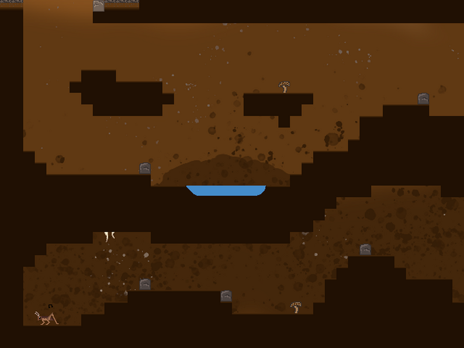

# cr1ckt

Entry for the 2021 Game Off jam, themed "BUG".  You can download or play in-browser at [sinisterstuf.itch.io/cr1ckt](https://sinisterstuf.itch.io/cr1ckt).

Some bugs in this game are intentional! ;)

You may be interested in help for [game testers](#for-game-testers), for [level makers](#for-level-makers) or for [programmers](#for-programmers).

## For game testers

For alpha testing use this [link to download the latest Windows EXE](https://nightly.link/sinisterstuf/cr1ckt/workflows/build-exe/master/cr1ckt-bundle.zip).

For Mac & Linux it is trivial to install go with your package manager and built it yourself, see [the section for programmers](#for-programmers) below.

During development there's debug info at the top showing things like player location and velocity, level number, etc. and some controls:

- F: toggle full-screen
- N: go to next map
- Q: quit the game
- Space: jump (this is a real game control, not just for testing)

If the game is crashing you can get extra information about what went wrong if you start it from the console.  On Windows, that means:

1. Open PowerShell
2. Go to the folder where the game is, e.g. `cd C:\Users\Alice\Downloads`
3. Run it like this: `.\cr1ckt.exe`

Some values the game uses can be overridden by putting a configuration "ini" file `cr1ckt.ini` next to the game EXE file.  An example INI file is provided in the download bundle above.

## For level makers

You can edit the levels using the Level Designer Toolkit ([LDtk](https://ldtk.io/)).

Get the latest version of the maps file and associated images [from this download bundle](https://nightly.link/sinisterstuf/cr1ckt/workflows/build-exe/master/cr1ckt-bundle.zip).

If you put a copy of the `maps.ldtk` file with your changes in it in the same folder as the game binary (e.g. `cr1ckt.exe`) then it will load that instead of the maps embedded in the binary, which is useful for prototyping and testing when developing a map because you don't have to compile any code.  This also requires you to have the `tiles.png` file in a folder called `assets` otherwise the game can't find it.

- Auto-tiling is done on the layer called IntGrid (tutorial on [auto-tiling](https://ldtk.io/docs/tutorials/intgrid-layers/))
- [Entities](https://ldtk.io/docs/general/editor-components/entities/) (e.g. the player, monsters, items) are on the Entities layer

## For programmers

To build the game yourself, run: `go build .`

I'm using Go 1.17 for this.  You might have luck with an older version but the go:embed feature is only available in 1.16 so you can't go lower than that.

The Go build system will handle the rest of the dependencies for you but if you're curious, it's using:
- [ebiten](https://github.com/hajimehoshi/ebiten/) simple 2D game library
- [ldtkgo](https://github.com/SolarLune/ldtkgo) to interface with LDtk
- that's it so far

You can run the test suite with `go test ./...` but I haven't written any yet.

The project structure will probably stay quite simple, most logic is in the "main" file and gets extracted elsewhere as a clump of closely related code gets too big there.
